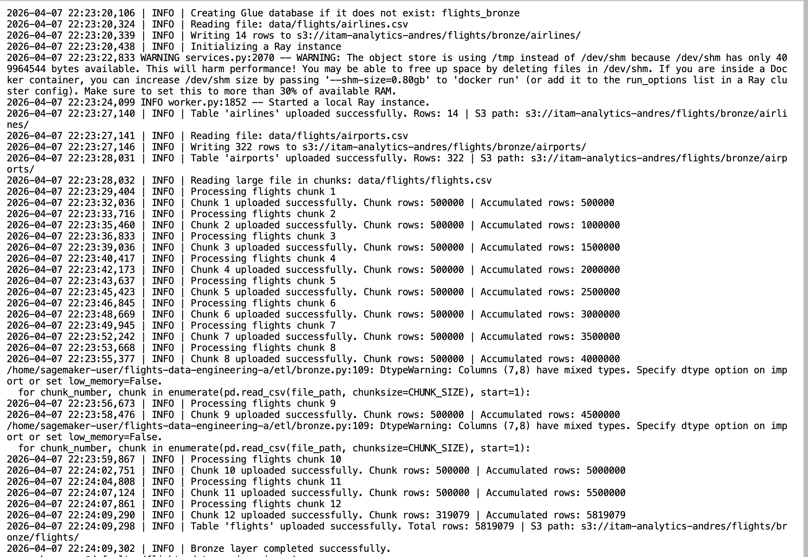
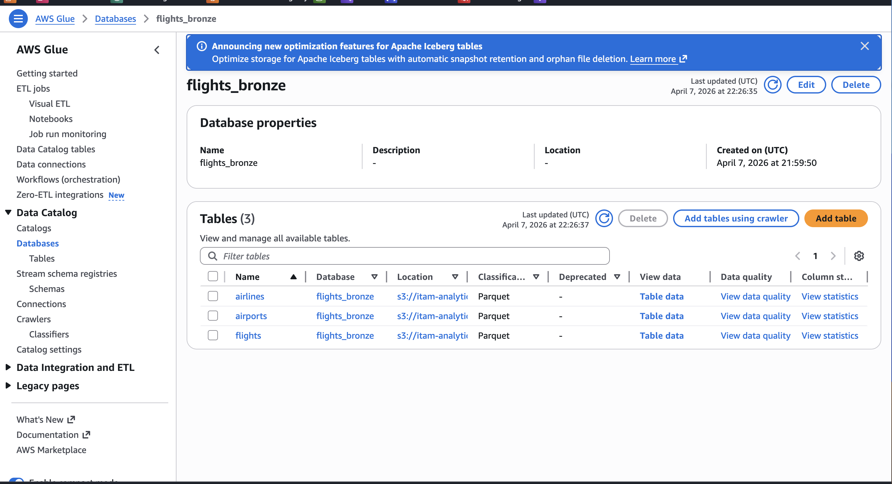
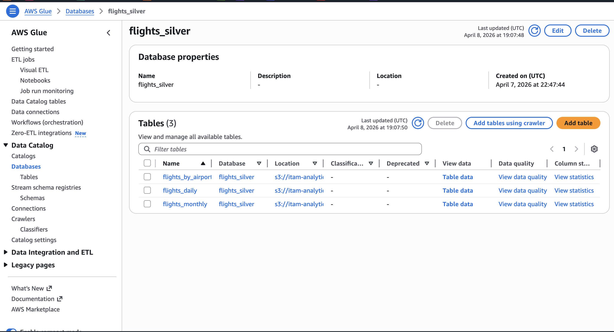
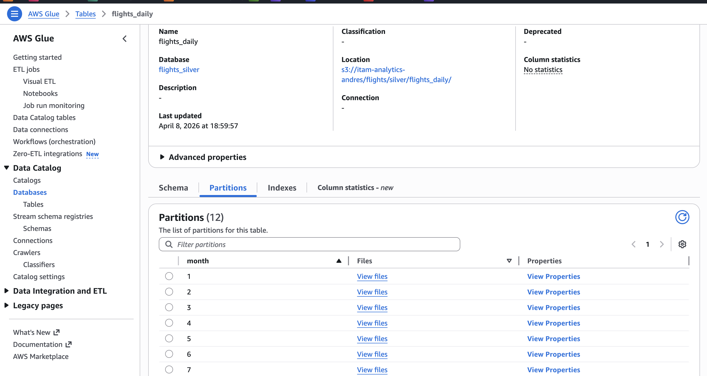
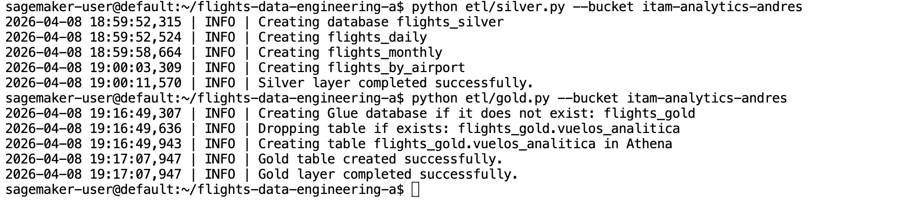
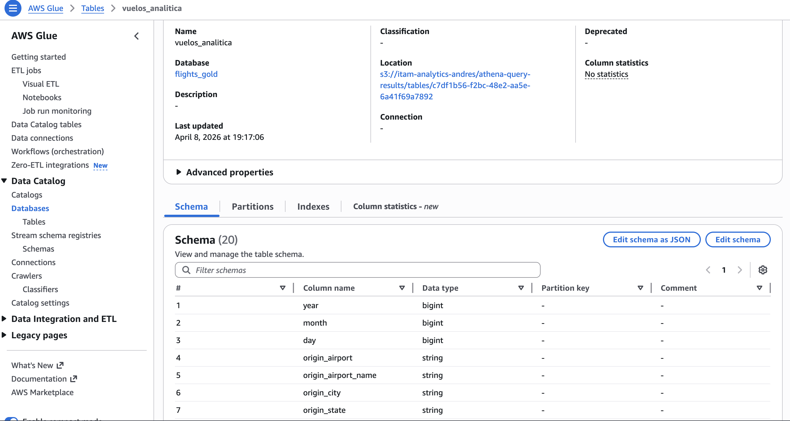
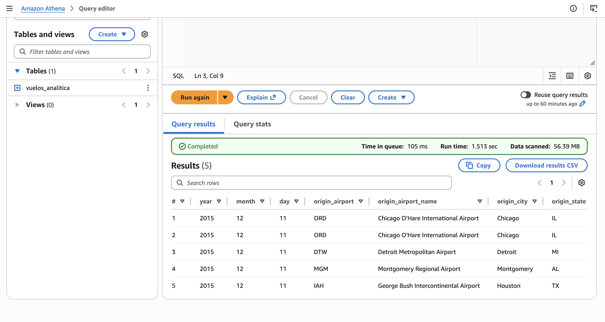
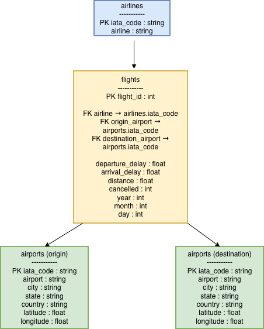
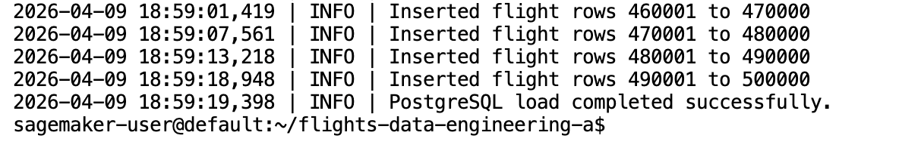
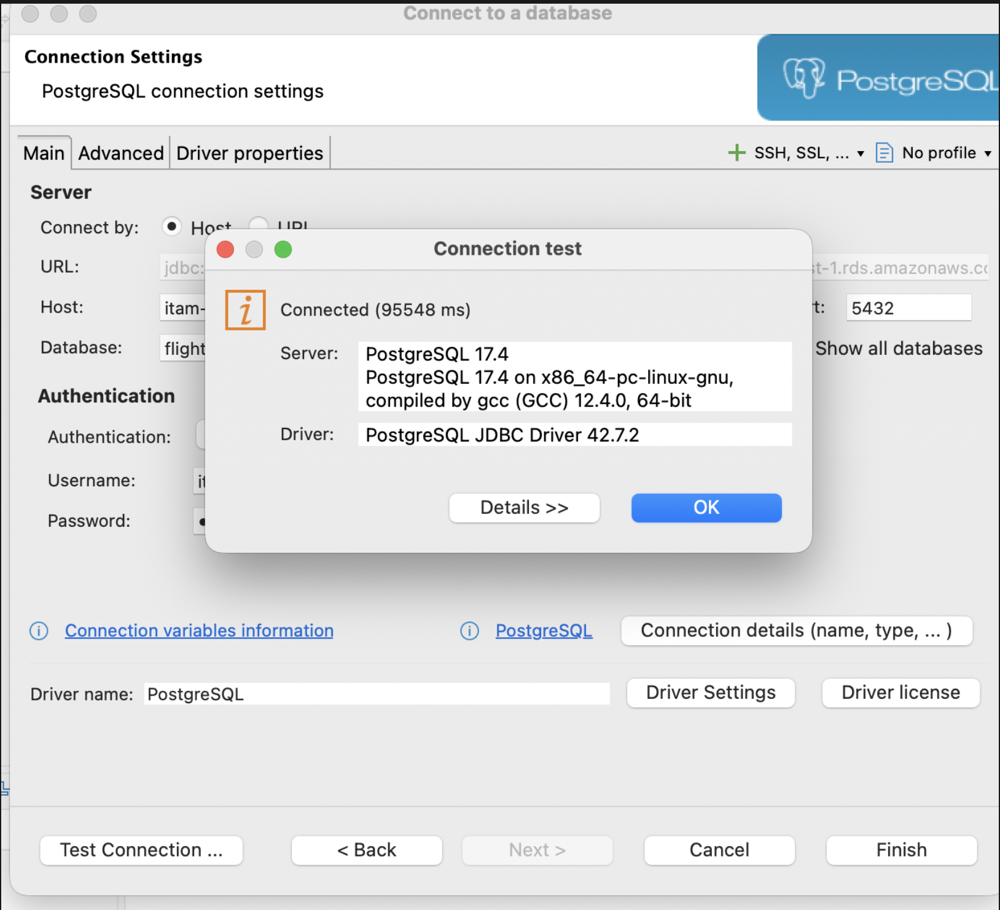

# flights-data-engineering-a

Tarea 08. Métodos de Gran Escala 2026

# Tarea 08: Data Engineering End-to-End — Flights Dataset

> Un análisis contesta una pregunta. Un pipeline de datos la contesta todos los días, de forma confiable, sin que nadie tenga que intervenir. En esta tarea construyo ese pipeline: desde los CSVs crudos hasta el análisis estadístico, pasando por una arquitectura Medallion en S3 y Athena, un modelo relacional en PostgreSQL y un notebook de análisis con regresión y pronóstico de series de tiempo. El dataset corresponde al registro completo de vuelos domésticos en Estados Unidos durante 2015, con aproximadamente 5.8 millones de vuelos, tres tablas y decisiones reales de diseño de datos.

## Objetivo

El objetivo de este proyecto fue construir de extremo a extremo un pipeline de datos sobre el dataset de vuelos de 2015. En particular, se desarrollaron scripts ETL en Python para implementar una arquitectura Medallion Bronze → Silver → Gold sobre AWS S3 y Athena con Glue Data Catalog, un modelo relacional en PostgreSQL provisionado con CloudFormation y cargado con SQLAlchemy, así como un notebook de análisis en Jupyter para responder consultas SQL, visualizar resultados, ajustar una regresión lineal con `statsmodels` y generar pronósticos de series de tiempo con `StatsForecast`.

## Contexto del dataset

El dataset está compuesto por tres archivos principales:

| Archivo | Filas | Descripción |
|---------|-------|-------------|
| `flights.csv` | ~5.8M | Un registro por vuelo: fechas, aerolínea, origen, destino, demoras, cancelaciones |
| `airlines.csv` | 14 | Catálogo de aerolíneas: código IATA y nombre completo |
| `airports.csv` | 322 | Catálogo de aeropuertos: código IATA, nombre, ciudad, estado, latitud y longitud |

Las variables más relevantes de `flights.csv` incluyen la fecha del vuelo (`YEAR`, `MONTH`, `DAY`), la aerolínea (`AIRLINE`), el aeropuerto de origen y destino (`ORIGIN_AIRPORT`, `DESTINATION_AIRPORT`), retrasos de salida y llegada (`DEPARTURE_DELAY`, `ARRIVAL_DELAY`), indicador de cancelación (`CANCELLED`), causa de cancelación (`CANCELLATION_REASON`), distancia (`DISTANCE`) y los componentes específicos de retraso (`AIR_SYSTEM_DELAY`, `AIRLINE_DELAY`, `WEATHER_DELAY`, `LATE_AIRCRAFT_DELAY`, `SECURITY_DELAY`).

## Estructura general del proyecto

El repositorio contiene los siguientes componentes principales:

- `etl/bronze.py`: ingesta de datos crudos a S3 y registro en Glue.
- `etl/silver.py`: transformación a Parquet + Snappy y construcción de agregaciones.
- `etl/gold.py`: creación de la tabla analítica Gold mediante CTAS en Athena.
- `db/models.py`: definición del esquema relacional en SQLAlchemy.
- `db/load_postgres.py`: carga masiva de datos a PostgreSQL.
- `docs/`: diagrama ERD y screenshots de evidencia.
- `flights_analytics.ipynb`: notebook con consultas SQL, visualizaciones, regresión y pronóstico.

---

## 1. Inicialización del repositorio

Se creó el repositorio público `flights-data-engineering-a` y se trabajó siguiendo una estrategia de ramas:

- `main`
- `development`
- `feature/data-engineering-flights`

Se descargaron los datos y se descomprimieron localmente en `data/`, dejando esta carpeta excluida del repositorio mediante `.gitignore`.

```bash
aws s3 cp s3://itam-analytics-andres/flights-hwk/flights.zip . --no-sign-request
unzip flights.zip -d data/
```

## 2. ETL — Arquitectura Medallion

El pipeline se implementó con tres scripts independientes, ejecutables desde terminal, usando `logging`, `argparse`, validaciones con `assert`, manejo de errores con `try/except` y comportamiento idempotente.

### 2.1 Buenas prácticas aplicadas

Los scripts ETL fueron diseñados con enfoque de producción:

Se utilizó `logging` en lugar de print para registrar `timestamp`, nivel y mensaje.
Se usó `argparse` para parametrizar bucket y rutas externas.
Se incorporó manejo explícito de errores con salida no silenciosa.
Se validó la integridad mínima de los DataFrames antes de escribir.
Se garantizó idempotencia con modos overwrite y borrado previo de tablas cuando fue necesario.
La lógica se organizó en funciones y en un bloque `main()`.

### 2.2 Capa Bronze

La capa Bronze preserva la fuente de verdad. En esta etapa se subieron los tres archivos crudos a S3 sin transformaciones y se registraron automáticamente en Glue Catalog dentro de la base de datos `flights_bronze`.

Las rutas de almacenamiento usadas fueron:

s3://<bucket>/flights/bronze/flights/
s3://<bucket>/flights/bronze/airlines/
s3://<bucket>/flights/bronze/airports/

Se cargaron exitosamente 14 registros en airlines, 322 registros en airports y 5,819,079 registros en flights.

- Evidencia Bronze

Ejecución del script Bronze

Glue Catalog — base de datos

### 2.3 Capa Silver

La capa Silver transforma los datos de Bronze a formato Parquet + Snappy y genera tres tablas analíticas agregadas:

`flights_daily`
`flights_monthly`
`flights_by_airport`
`flights_daily`

Agrega por día (`YEAR, MONTH, DAY`) y calcula:

`total_flights`
`total_delayed`
`total_cancelled`
`avg_departure_delay`
`avg_arrival_delay`

Además, se particionó por `MONTH`, con 12 particiones.

`flights_monthly`

Agrega por mes y aerolínea (`MONTH, AIRLINE`) y calcula:

`total_flights`
`total_delayed`
`total_cancelled`
`avg_arrival_delay`
`on_time_pct`
`flights_by_airport`

Agrega por aeropuerto de origen (`ORIGIN_AIRPORT`) y calcula:

`total_departures`
`total_delayed`
`total_cancelled`
`avg_departure_delay`
`pct_weather_delay`

- Evidencia Silver


Ejecución del script Silver

Glue Catalog — base de datos flights_silver

### 2.4 Capa Gold

La capa Gold se construyó con un CTAS en Athena para crear una tabla analítica desnormalizada llamada `flights_gold.vuelos_analitica`, uniendo vuelos con catálogos de aerolíneas y aeropuertos.

Esta tabla incluye variables como:

fecha del vuelo
aeropuerto de origen y nombre del aeropuerto
ciudad y estado de origen
aeropuerto de destino y nombre del aeropuerto
nombre de aerolínea
retrasos
cancelaciones
distancia
componentes específicos de retraso

- Evidencia Gold


Ejecución del script Gold

Glue Catalog — tabla vuelos_analitica

Validación en Athena con SELECT ... LIMIT 5


## 3. PostgreSQL y modelo relacional
### 3.1 CloudFormation

Se provisionó una instancia PostgreSQL con Read Replica usando CloudFormation, siguiendo el patrón visto en clase. La base de datos se llamó flights y se usaron dos endpoints:

`RdsEndpoint`: instancia primaria para escritura
`RdsReplicaEndpoint`: réplica para lectura analítica


### 3.2 ERD

Se diseñó un diagrama entidad-relación con tres entidades:

`airlines`
`airports`
`flights`

La tabla `flights` contiene dos claves foráneas hacia `airports`: una para el aeropuerto de origen y otra para el de destino.



### 3.3 Tablas en PostgreSQL

El esquema relacional fue implementado con SQLAlchemy 2.0 en `db/models.py`, respetando llaves primarias, foráneas y relaciones.


### 3.4 Carga de datos

La carga se hizo con bulk insert usando session.execute(insert(Model), records), respetando el orden de dependencias:

`airlines`
`airports`
`flights`

Para flights se cargaron los primeros 500,000 registros,



### 3.5 Conexión con DBeaver

Se configuró una conexión a la Read Replica en DBeaver para ejecutar las consultas analíticas solicitadas.

